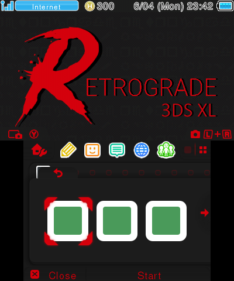
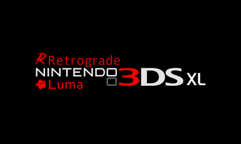
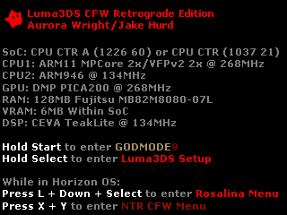

# Retro's XDS Collection
Collection of things for the last generations of Nintendo's Dual Screen console lineup. Everything placed here was used on an O3DSXL. While it is possible these may work with an N-variant, this hasn't been confirmed or tested since I do not own one. You are free to try, but...
> [!CAUTION]  
> **I am not responsible for anything that could go wrong as a result of your actions, or any incorrect configurations. You should always make sure things seem correct before you add anything to your system. Also, make sure to have a NAND backup just in case.**

## Prerequisites
### Luma3DS
Everything in this repo relies on your console having [Luma3DS](https://github.com/LumaTeam/Luma3DS) installed. If you need to check, hold down `select` as you power your console on.
- If you boot into the `Luma3DS Configuration` screen:
  - Continue to the [required homebrew](#required-homebrew) section for a sanity check.
- If you do not have `Luma3DS`:
  - Follow [this guide here](https://3ds.hacks.guide/get-started.html).
### Required Homebrew
It will also assume you have the basics of 3DS Homebrew installed, such as:
- [ftpd](https://github.com/mtheall/ftpd)
- [TWiLight Menu++](https://github.com/DS-Homebrew/TWiLightMenu)
- [Anemone3DS](https://github.com/astronautlevel2/Anemone3DS)
> [!NOTE]
> These should all be downloadable via Universal Updater. If you followed the linked guide for Luma3DS, then the chances are you also ran the scripts at the end of your installation, which should install most of these by default.

## Files & Previews
> [!NOTE]
> The folder "SDRoot" should be treated as the root folder of your SD card. This will contain things such as themes, splash screens you can configure in `Luma3DS` and various other misc stuff, when added. To keep this readme clean, the previews can be seen in the spoilers below. Feel free to check them out. You will notice a lot of the "R" branding here, as these are what I personally use on my devices.

  
rTheme & rTheme Clean Preview

| rTheme | rTheme Clean |
| --- | --- |
|  |  |

- Made from scratch using kame-editor.

  
Boot/Splash Screen

| Top Splash | Bottom Splash |
| --- | --- |
|  |  |

- Thanks to Vendicatorealato and all previous users who worked on this splash.

# Shout outs

  
Thank you to the wonderful DS modding community and the people keeping these consoles alive.

  
  - LumaTeam - `Luma3DS`
  - d0k3 - `GODMODE9`
  - mtheall - `ftpd`
  - astronautlevel2 - `Anemone3DS`
  - DS-Homebrew / Rocket Robz - `TWiLight Menu++`
  - Universal-Team - `Universal Updater`
  - beelzy - `kame-editor`
  - jiggly - `splash-ds`
  - And everyone else... Without you all, this wouldn't exist.

